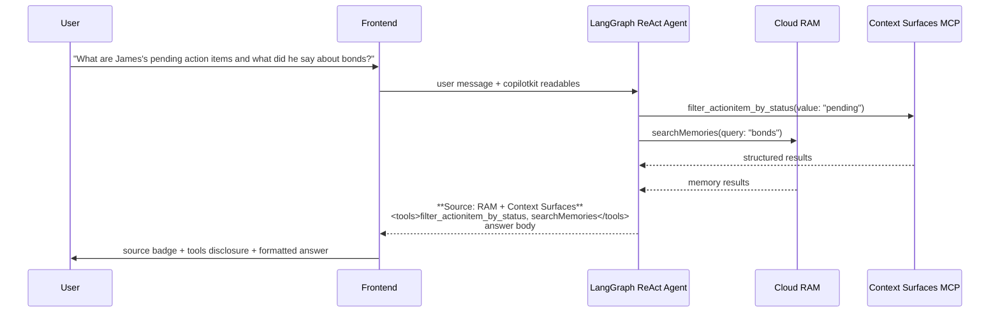

# Context Surfaces Integration

## Overview

Context Surfaces provides a structured data layer alongside Cloud RAM. While RAM stores conversational memories (what was said in meetings, sentiments, extracted facts), Context Surfaces stores authoritative structured records (portfolio holdings, financial goals, client profiles, action items) as indexed entities queryable via auto-generated MCP tools.

The chatbot agent has access to both data layers and routes questions to the appropriate source based on the query type.

## Architecture

```
Frontend (CopilotSidebar)
  │
  │ Custom AssistantMessage component
  │ (parses source badge + tools disclosure)
  ▼
Backend (/copilotkit endpoint)
  │
  ▼
LangGraph Server (port 2024)
  │
  │ createReactAgent
  ├──────────────────────────────────────┐
  │                                      │
  ▼                                      ▼
cau-ram (5 tools)               cau-context-surfaces (N tools)
  → Cloud RAM API                 → Context Surfaces MCP Server
```

## Data Layer Separation

| Concern     | Cloud RAM                            | Context Surfaces                                        |
| ----------- | ------------------------------------ | ------------------------------------------------------- |
| Data type   | Conversational (memories, events)    | Structured (records, facts)                             |
| Source      | Extracted from transcripts by LLM    | Hand-authored JSON, loaded once                         |
| Query style | Semantic search, session scoping     | TAG filters, text search, range queries                 |
| Mutability  | Grows over time as meetings play     | Static per dataset load                                 |
| Tool naming | `searchMemories`, `getMemoryContext` | `filter_<entity>_by_<field>`, `search_<entity>_by_text` |

## Surface Setup Flow

### Create-Once, Reuse-Always

Surface ID and agent key are stored as env vars. The API server startup logic:

1. If `CTX_SURFACE_ID` **and** `MCP_AGENT_KEY` are set in `.env` -> skip creation, log "reusing surface"
2. If either is missing -> create surface from dataset config schema, load entity records from `client-data.json`, create agent key, log values for `.env`

This runs in `backend/src/services/context-surfaces-setup.service.ts`, called from `backend/src/index.ts` during app initialization.

### LangGraph Server Connection

The LangGraph process (`graph.ts`) reads env vars and creates a `ContextSurfaces` client instance. It does NOT create surfaces or load data -- it only connects and queries.

```
API Server (index.ts)          LangGraph Server (graph.ts)
  │                              │
  │ Creates surface + loads      │ Reads CTX_SURFACE_ID,
  │ data (first run only)        │ MCP_AGENT_KEY from env
  │                              │
  │ Stores surfaceId,            │ Creates ContextSurfaces
  │ agentKey in .env             │ client instance
  │                              │
  ▼                              ▼
Redis Cloud (Surface persists independently of both processes)
```

Run order does not matter once env vars are set.

## Tool Registration (`tools.ts`)

### How MCP tools become LangGraph tools

1. `ContextSurfaces.getInstance().listTools()` fetches available MCP tools for the surface
2. Each MCP tool is wrapped in a `DynamicStructuredTool` via `wrapMcpTool()`
3. The wrapper converts JSON Schema parameters to Zod schemas and delegates execution to `cs.callTool(name, args)`
4. Results are extracted from JSON-RPC format to plain text via `extractMcpText()`

### Tool categories

**RAM tools (5):**

- `searchMemories` -- semantic search across all long-term memories
- `searchMemoriesBySession` -- search within a specific session
- `getMemoryContext` -- hydrated memory prompt (session + long-term combined)
- `listSessions` -- list available session IDs
- `getSessionState` -- session metadata

**Context Surfaces tools (auto-generated, count depends on entity schema):**

- `filter_<entity>_by_<field>` -- TAG filter exact match
- `search_<entity>_by_text` -- full-text search
- `get_<entity>_by_id` -- primary key lookup
- `find_<entity>_by_<field>_range` -- numeric range query

Tool count depends on the entity schema in `dataset.config.json`.

## Dynamic System Prompt (`system-prompt.ts`)

The system prompt is built dynamically from the MCP tool definitions at startup. No hardcoded entity names or dataset-specific references.

### What's dynamic (derived from `McpToolDef[]`):

- Entity list (parsed from tool names: `filter_holding_by_*` -> "Holding")
- Tool hints block (each tool name + description listed)

### What's static:

- RAM vs Context Surfaces routing guidance
- Tool calling rules (anti-loop, multi-call encouragement)
- Source attribution format
- Session routing decision tree

### Source attribution

The LLM outputs a structured header parsed by the frontend:

```
**Source: RAM Session + Long-Term Memory**
<tools>getMemoryContext</tools>

The answer body...
```

Labels are chosen by the LLM based on which tools were called and what data was returned.

## Frontend: Custom Message Rendering

### Custom `AssistantMessage` component

CopilotKit's `CopilotSidebar` accepts a custom `AssistantMessage` component (`frontend/src/components/core/assistant-message.component.tsx`).

It parses the LLM output for:

1. `**Source: ...**` line -> rendered as a styled badge (`<div class="assistant-message__source">`)
2. `<tools>...</tools>` line -> rendered as a collapsible `<details>` showing tool names
3. Remaining text -> passed to CopilotKit's `Markdown` renderer

This cleanly separates attribution UI from markdown content rendering.

## Configuration

| Variable            | Required          | Purpose                                  |
| ------------------- | ----------------- | ---------------------------------------- |
| `CTX_ADMIN_KEY`     | Yes (for CS)      | Admin API key from Redis Cloud           |
| `CTX_ADMIN_API_URL` | No (has default)  | Admin REST endpoint                      |
| `CTX_MCP_URL`       | No (has default)  | MCP server endpoint                      |
| `CTX_SURFACE_ID`    | No (auto-created) | Reuse existing surface                   |
| `MCP_AGENT_KEY`     | No (auto-created) | Reuse existing agent key                 |
| `REDIS_URL`         | Yes               | Redis connection for surface data source |

## Data Files

| File                                      | Purpose                                                                     |
| ----------------------------------------- | --------------------------------------------------------------------------- |
| `data/wealth-advisor/client-data.json`    | Structured entity records (Client, Holding, FinancialGoal, ActionItem)      |
| `data/wealth-advisor/dataset.config.json` | Contains `contextSurfaces` config: surface name, entity schema (data model) |

## Data Flow



## Test Questions

### Context Surfaces Only

| #   | Question                                         | Expected Tool(s)                      |
| --- | ------------------------------------------------ | ------------------------------------- |
| 1   | "What is James Morrison's portfolio allocation?" | `filter_holding_by_client_id`         |
| 2   | "What equities does James hold?"                 | `filter_holding_by_asset_class`       |
| 3   | "What are James's financial goals?"              | `filter_financialgoal_by_client_id`   |
| 4   | "Are there any pending action items?"            | `filter_actionitem_by_status`         |
| 5   | "Search for goals related to retirement"         | `search_financialgoal_by_text`        |
| 6   | "List all holdings worth more than $500K"        | `find_holding_by_current_value_range` |

### RAM Only

| #   | Question                                      | Expected Tool(s)                    |
| --- | --------------------------------------------- | ----------------------------------- |
| 7   | "What happened in this meeting?"              | `getMemoryContext`                  |
| 8   | "What did James say about REIT concerns?"     | `searchMemories`                    |
| 9   | "What was discussed about Emily's education?" | `searchMemories`                    |
| 10  | "Summarize the Feb 26 call"                   | `listSessions` + `getMemoryContext` |

### Combined (RAM + Context Surfaces)

| #   | Question                                                                    | Expected Tool(s)                                           |
| --- | --------------------------------------------------------------------------- | ---------------------------------------------------------- |
| 11  | "What is James's current allocation and what did he say about rebalancing?" | CS: `filter_holding_by_client_id`; RAM: `getMemoryContext` |
| 12  | "What is the retirement goal target and what has been discussed about it?"  | CS: `filter_financialgoal_by_type`; RAM: `searchMemories`  |
| 13  | "Show pending action items and what context was discussed for each"         | CS: `filter_actionitem_by_status`; RAM: `searchMemories`   |

### Edge Cases

| #   | Question                                         | Expected Behavior                                              |
| --- | ------------------------------------------------ | -------------------------------------------------------------- |
| 14  | "Tell me about this meeting" (no active session) | Responds that no active session exists, falls back to all data |
| 15  | "What is the weather today?"                     | Responds that it cannot answer -- no relevant tools            |
| 16  | "List everything you know about James"           | Calls BOTH RAM search + multiple CS tools                      |
