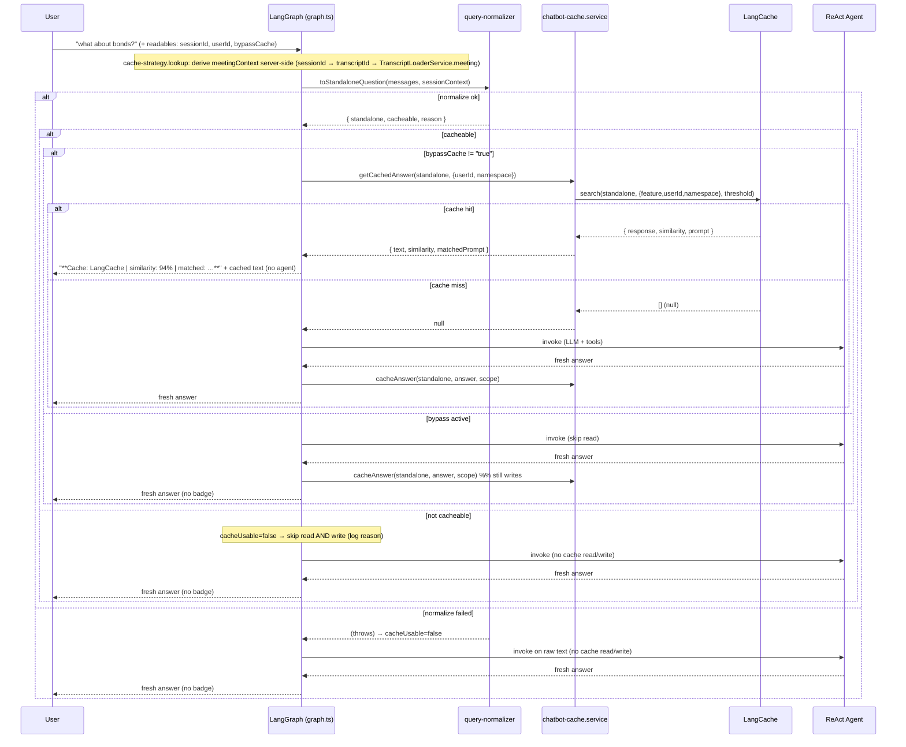

# LangCache Integration (Chatbot Semantic Cache)

## Overview

This plan adds [LangCache](https://redis.io/docs/latest/develop/ai/langcache/) — Redis' managed semantic cache — to the chatbot so that semantically similar questions return a cached answer instead of re-running the LangGraph ReAct agent (which spends OpenAI tokens + multiple Cloud RAM / Context Surfaces tool round-trips per turn).

The chatbot is the target call site. Semantic caching is well suited to it because:

- Demo users (and demo presenters) tend to ask the **same handful of questions** repeatedly ("What happened in this meeting?", "What did James say about bonds?").
- Each chatbot turn is expensive: a ReAct loop = N LLM calls + N tool calls.
- A cache hit collapses that to a single vector search (~tens of ms) and zero LLM tokens.

**Scope of this plan (v1):**

- The **chatbot only**. LangCache is scoped exclusively to the chatbot; the real-time suggestion agent is intentionally **out of scope permanently** (suggestions are inherently fresh/streaming and are never cached).
- **Always-on query normalization** — every turn is rewritten to a standalone question before any cache op (this is what makes the cache production-grade, not a demo trick). The same LLM call also returns an **LLM-judged cacheability decision** (see [Cacheability decision](#cacheability-decision-llm-judged)).
- **Chatbot settings menu** (gear icon → popover) in the chatbot UI, holding a **bypass-cache toggle** in v1 (skips the cache read for subsequent turns; agent runs fresh and the fresh answer is still written) and designed to hold more settings later.
- **Cache-hit badge** in the `AssistantMessage` component — "LangCache · X% match", with an inline second line showing the matched cached question ("matched: …").

> **Note on code organization:** the cache orchestration (readable extraction, server-side meeting-context derivation, normalize, cache read, hit-badge build, cache write) lives in [backend/src/chatbot-agent/cache-strategy.ts](../../backend/src/chatbot-agent/cache-strategy.ts) as `ChatbotCacheStrategy.lookup` / `ChatbotCacheStrategy.store`. `graph.ts` `runAgentWithCache` is a thin wrapper that calls `lookup`, serves `turn.hit` if present, otherwise runs the agent and calls `store`.

> **Note:** LangCache is in preview on Redis Cloud; the SDK is in beta and may have breaking changes between minor versions, so we pin the version.

## How LangCache Works

1. App sends the prompt to LangCache (`search`).
2. LangCache embeds the prompt and vector-searches stored entries (optionally filtered by attributes).
3. **Hit** → returns the stored response instantly (no LLM call).
4. **Miss** → app runs the LLM/agent, then stores the result (`set`) for next time.

```
User question
     │
     ▼
LangCache.search(prompt, attributes, similarityThreshold)
     │
 ┌───┴───────────────┐
 │ hit               │ miss
 ▼                   ▼
return cached      run ReAct agent ──► LangCache.set(prompt, response, attributes, ttl)
response                                │
                                        ▼
                                  return fresh response
```

## SDK Choice & API Note (IMPORTANT)

We use the published npm package **`@redis-ai/langcache`**, pinned to the **latest `0.11.x`** (currently `0.11.1`).

The reference repo (`demos/langgraph-pm-maestro`) uses an **old `0.2.8`** API that is **incompatible** with the current package. Do **not** copy that usage verbatim. The differences:

| Concern         | Old `0.2.8` (pm-maestro)                                            | New `0.11.1` (this project)                                                                                     |
| --------------- | ------------------------------------------------------------------- | --------------------------------------------------------------------------------------------------------------- |
| Class           | `LangcacheSDK`                                                      | `LangCache`                                                                                                     |
| `cacheId`       | passed per-call                                                     | passed in constructor                                                                                           |
| Auth            | none (self-hosted docker, auth disabled)                            | `apiKey` in constructor (Redis Cloud managed)                                                                   |
| Save            | `sdk.cacheEntryEndpoints.cache({ cacheId, saveCacheEntryRequest })` | `langCache.set({ prompt, response, attributes?, ttlMillis? })` → `{ entryId }`                                  |
| Search          | `sdk.cacheEntryEndpoints.search(...)` → `CacheEntry[]`              | `langCache.search({ prompt, similarityThreshold?, searchStrategies?, attributes? })` → `{ data: CacheEntry[] }` |
| Delete by id    | `deleteEntry({ cacheId, entryId })`                                 | `langCache.deleteById(id)`                                                                                      |
| Delete by attrs | `deleteEntries({ cacheId, deleteEntriesRequest })`                  | `langCache.deleteQuery({ attributes })` → `{ deletedEntriesCount }`                                             |
| Flush all       | (n/a)                                                               | `langCache.flush()`                                                                                             |
| Match score     | entry.**distance** (lower = closer)                                 | entry.**similarity** (higher = closer)                                                                          |

New SDK shapes (verified against the package's `dist` type declarations):

```typescript
// search result entry
type CacheEntry = {
  id: string;
  prompt: string;
  response: string;
  attributes: { [k: string]: string };
  similarity: number; // normalized cosine similarity, higher = closer
  searchStrategy: SearchStrategy;
};

// search() returns { data: CacheEntry[] }            (empty array on miss)
// set()    returns { entryId: string }
// deleteQuery() returns { deletedEntriesCount: number }
```

Minimal usage:

```typescript
import { LangCache } from "@redis-ai/langcache";

const langCache = new LangCache({
  serverURL: ENV.LANGCACHE_SERVER_URL,
  cacheId: ENV.LANGCACHE_CACHE_ID,
  apiKey: ENV.LANGCACHE_API_KEY,
});

// search filters ONLY by the three partition attributes — never by rawQuestion
const { data } = await langCache.search({
  prompt: "What did James say about bonds in the Feb 26 2026 meeting?", // normalized
  similarityThreshold: 0.92,
  attributes: { feature: "chatbot", userId: "sarah-chen", namespace: "wealth-advisor" },
});

if (data.length === 0) {
  const response = await runAgent(...);
  await langCache.set({
    prompt: "What did James say about bonds in the Feb 26 2026 meeting?", // normalized (embedded key)
    response,
    // partition filters + a metadata-only `rawQuestion` (the user's original text, for demo/observability)
    attributes: {
      feature: "chatbot",
      userId: "sarah-chen",
      namespace: "wealth-advisor",
      rawQuestion: "what about bonds?", // metadata only — NOT passed to search()
    },
    ttlMillis: 600000,
  });
}

// on a hit, data[0].attributes.rawQuestion === the original phrasing that first populated the entry
```

## Architecture

Following the project's `cau-*` facade convention (`cau-ram` wraps the agent-memory SDK, `cau-redis` wraps `redis`), LangCache is wrapped by a new package **`cau-langcache`**. Consumers never import the SDK directly, so we can swap/upgrade the SDK without touching call sites.

```
LangGraph Server (graph.ts, port 2024)             API Server (index.ts, port 3001)
  │  chatbot ReAct agent                             │  resetLifecycle handler
  │  runAgentWithCache (thin wrapper)                ▼
  ▼                                                  │
backend/src/chatbot-agent/cache-strategy.ts         │
  │  ChatbotCacheStrategy.lookup / .store            │
  │  (readables, meeting-context, normalize,         │
  │   cacheable gate, read, hit-badge, write)        │
  ├──────────────► query-normalizer.ts               │
  │                  (standalone rewrite +           │
  │                   cacheable decision)            │
  ▼                                                  │
backend/src/services/chatbot-cache.service.ts ◄──────┘
  │  (chatbot-specific scope + get/set/clear logic)    clearForUser(userId) on reset
  ▼
cau-langcache  ── LangCache facade (singleton) ──►  LangCache service (Redis Cloud / self-hosted)
```

Both processes initialize a `LangCache` singleton (mirroring how each process independently initializes `RedisAgentMemory`):

- **LangGraph process**: `ChatbotCacheStrategy.lookup` normalizes + judges cacheability → reads cache (before agent); `ChatbotCacheStrategy.store` writes cache (after agent).
- **API server process** clears cache on `resetLifecycle`.

## Caching Strategy for the Chatbot

### Cache key = normalized standalone prompt + attribute filters

- **Prompt** (what gets embedded): the **fully-normalized standalone form** of the user's question (see [Query normalization](#query-normalization-standalone-question-rewrite--always-on)) — applied to every turn, never the raw text.
- **Filter attributes** (exact-match filters that partition the cache; passed to **both** `search` and `set`):

| Attribute   | Value                                     | Source                                 | Why                                                                      |
| ----------- | ----------------------------------------- | -------------------------------------- | ------------------------------------------------------------------------ |
| `feature`   | `"chatbot"`                               | constant `LANGCACHE_FEATURE`           | Tags all entries as chatbot-produced (hygiene/guard within one cache id) |
| `userId`    | e.g. `sarah-chen`                         | "User ID for memory scoping" readable  | Answers are personalized to a user's memories — never serve across users |
| `namespace` | active dataset id (e.g. `wealth-advisor`) | **`ENV.ACTIVE_DATASET`** (process env) | Different dataset = different world of data                              |

> **`namespace` is read from `ENV.ACTIVE_DATASET`, not from a readable.** The frontend (`page.tsx`) only sends two readables — session ID and user ID. There is no namespace readable; the LangGraph process already knows the active dataset from its environment.

- **Metadata-only attributes** (stored on `set`, **never** passed to `search`):

| Attribute     | Value                    | Source            | Why                                                                                       |
| ------------- | ------------------------ | ----------------- | ----------------------------------------------------------------------------------------- |
| `rawQuestion` | the user's original text | last user message | Debugging/observability — inspect the raw → normalized mapping directly in the cache data |

> **Why `attributes` and not a separate "metadata" field:** LangCache (SDK `0.11.1`) has **no dedicated metadata field**. An entry is `{ id, prompt, response, attributes, similarity, searchStrategy }` and `set` accepts only `{ prompt, response, attributes?, ttlMillis? }`. The `attributes` map (`string → string`) is the only place for arbitrary key/values, so `rawQuestion` lives there.

> **Critical: `rawQuestion` must be metadata-only.** LangCache attributes are exact-match filters. If `rawQuestion` were included in the `search` call it would partition the cache by literal phrasing and destroy every hit (defeating normalization). It is therefore written on `set` only — never passed to `search`. Because we never filter on it, its high cardinality has no effect on search behavior (negligible storage at demo scale). It is for inspecting entries directly in the cache (no UI surfacing needed) and expires with the entry's TTL.

### Why `sessionId` is deliberately NOT an attribute

This was a real design decision, settled by looking at where the chatbot's answers actually come from (`chatbot.md`, `context-surfaces-integration.md`). The chatbot answers from **three** sources, and only one is session-bound:

| Source                                                             | Session-bound?         | Representative questions                         |
| ------------------------------------------------------------------ | ---------------------- | ------------------------------------------------ |
| Context Surfaces MCP (static structured data)                      | **No**                 | "What is James's portfolio allocation?" (Q1–6)   |
| RAM long-term memory (`searchMemories`, scoped by userId)          | **No** (cross-session) | "What did James say about REIT concerns?" (Q8–9) |
| RAM session memory (`getMemoryContext`, `searchMemoriesBySession`) | **Yes**                | "What happened in this meeting?" (Q7, Q10)       |

Two of the three categories — the **majority** of the chatbot's question space, and the most cacheable (deterministic CS lookups) — are **not** session-bound. Their answers are identical regardless of the active session. Adding `sessionId` as an attribute would partition the cache so that **every session switch cold-starts** even these session-independent questions, gutting the hit rate exactly where caching is most valuable.

Session-scoped questions instead get their uniqueness from the **normalized question itself**:

- "What happened in this meeting?" (active session = Feb 26) → "What happened in the **Feb 26 2026** client review with James Morrison?" — the meeting identity is embedded in the prompt, producing a unique cache key without an attribute.
- Switch to a Mar 05 session, ask the same raw question → normalizes to a **different** string → different embedding → natural miss. Correct, without an attribute.
- "What are James's financial goals?" (CS static data) → same normalized question across sessions → **hits across sessions**. Correct, and desirable.

**The attribute showcase** (a nice demo moment in its own right):

| Attribute        | What it isolates                                          | Demo moment                                                                  |
| ---------------- | --------------------------------------------------------- | ---------------------------------------------------------------------------- |
| `userId`         | User personalization — User B never gets Sarah's answers  | Same question, different user → miss                                         |
| `namespace`      | Dataset boundary — another persona/dataset never bleeds   | Same question, different dataset → miss                                      |
| _(no sessionId)_ | Not needed — normalized question carries meeting identity | Cross-session CS question hits; session question misses on different meeting |

> **Residual risk + mitigation (be honest about it):** two different sessions whose normalized questions differ **only by date** ("…the Feb 26 2026 meeting…" vs "…the Mar 05 2026 meeting…") could, in principle, exceed the similarity threshold and produce a wrong cross-session hit. Mitigations: (1) tune the threshold up for this demo (0.92–0.95) since session-scoped questions are near-identical apart from the meeting identity; (2) make the normalizer front-load the full meeting identity (date + type + participants) to maximize embedding divergence; (3) TTL + reset-clear bound staleness. This is an accepted demo-grade tradeoff — the alternative (`sessionId` attribute) trades a rare wrong-hit for a guaranteed low hit rate on the majority of questions.

### Query normalization (standalone-question rewrite) — always on

This is what makes the cache **production-grade** rather than a demo trick. **Every** user question — the first one _and_ every follow-up — is normalized into a fully self-contained, unambiguous standalone question **before** the cache is searched, and the _same_ normalized string is used to save on a miss. Reads and writes therefore always live in the same canonical embedding space, which drives reliable hit rates. It is also what makes the "no `sessionId` attribute" design correct — the standalone question is the _only_ thing carrying session identity.

We do **not** short-circuit the first turn with raw text. An "initial" question is often still context-bound ("What happened in **this** meeting?", "What did **he** decide?"), so it must be resolved too.

**The normalizer resolves, using the conversation history + the active-session readables + meeting context:**

- **Pronouns / ellipsis:** "what about bonds?" → "What was discussed about bonds …".
- **Deixis / context references:** "this meeting", "the call", "he/she/they", "that goal" → the concrete meeting and named entity.
- **Implicit scope:** bind the question to the meeting/participant it actually refers to, so the standalone question carries full meaning on its own.

**Examples (active session = "Feb 26 2026 client review with James Morrison"):**

| Turn               | Raw user text                                | Normalized standalone question                                                   |
| ------------------ | -------------------------------------------- | -------------------------------------------------------------------------------- |
| initial            | "What happened in this meeting?"             | "What happened in the Feb 26 2026 client review meeting with James Morrison?"    |
| follow-up          | "what about bonds?"                          | "What was discussed about bonds in the Feb 26 2026 meeting with James Morrison?" |
| follow-up          | "and what did he decide?"                    | "What did James Morrison decide in the Feb 26 2026 client review meeting?"       |
| already standalone | "What are James Morrison's long-term goals?" | returned semantically unchanged                                                  |

**The normalizer needs real meeting metadata — derived server-side, no new readable (verified against the loader services):** to resolve "this meeting" → "the 2025-09-14 phone call with James Morrison", the normalizer must know the active meeting's **date + type + participants**. That metadata lives in each transcript JSON's `meeting` object:

```jsonc
// data/wealth-advisor/transcripts/2025-09-14-phone.json
"meeting": {
  "id": "meeting-001",
  "date": "2025-09-14",
  "type": "phone",
  "durationMinutes": 28,
  "participants": { "rm": "Sarah Chen", "client": "James Morrison" },
  "summary": { "topics": [...], "keyDecisions": [...], "followUps": [...] }
}
```

The chatbot can reach it **without any frontend change**, because the existing `"Active session ID"` readable already encodes the transcript id:

- Session id format is `playback-<transcriptId>-<timestamp>` (`backend/src/handlers/working-memory.handlers.ts` → `` `${SESSION_ID_PREFIX}-${transcriptId}-${Date.now()}` ``), matched by `SESSION_ID_PATTERN = /^playback-(.+)-(\d{13,})$/`.
- `transcriptId` **is** the transcript filename stem — the same id `TranscriptLoaderService.loadTranscript(datasetId, transcriptId)` uses to read `data/<dataset>/transcripts/<transcriptId>.json` and return `{ meeting, chunks }`.
- The LangGraph process already loads from `ENV.DATA_DIR` via `DatasetLoaderService` (in `createCompiledGraph`), so `TranscriptLoaderService` works there too — same image, same mounted data.

So `graph.ts` builds the meeting context **server-side**: parse `transcriptId` from the `sessionId` readable → `TranscriptLoaderService.loadTranscript(ENV.ACTIVE_DATASET, transcriptId).meeting` → compose a label from `meeting.date` + `meeting.type` + `meeting.participants` (optionally `summary.topics`), e.g. `"2025-09-14 phone call · participants: Sarah Chen (RM), James Morrison (client)"`. There is no `meeting.title` field, so the label is composed from date + type + participants. Participant titles can be enriched from `datasetConfig.participants`. This is read-only, static per transcript, so it should be **memoized per `transcriptId`** in-process (avoid re-reading the file every turn). If there is no active session (`sessionId === "none"`), meeting context is empty — acceptable (those questions fall back to all-data answers; see Q14).

> This replaces the earlier idea of adding a frontend meeting-context readable: deriving it server-side keeps the cross-process contract unchanged and is strictly less frontend surface. It is still **in scope, not optional** — "drop sessionId + rely on normalization" cannot disambiguate sessions without it.
>
> **Existing readables are preserved — nothing is removed.** The two current readables stay exactly as-is: `"Active session ID for the current meeting playback"` and `"User ID for memory scoping"`. This feature only **adds** `"Bypass semantic cache"`. In fact the `"Active session ID"` readable becomes more important, since the server-side meeting-context lookup parses `transcriptId` from it.

**Quality bar / model:** correctness-critical, so it runs on a capable model at `temperature: 0` — it shares the chatbot model (`CHATBOT_MODEL`, from `MEETING_MEMORY_CHATBOT_MODEL`), **not** a deliberately "cheap" model — with a dedicated strict prompt and **structured output** (`withStructuredOutput`, zod schema `{ standalone, cacheable, reason }`):

- Preserve the user's original intent exactly; never add or invent constraints not implied by the conversation.
- Resolve every pronoun/deictic reference using the provided history + session + meeting context.
- If the question is already fully standalone, return it semantically unchanged.
- Also judge `cacheable` for the question (see [Cacheability decision](#cacheability-decision-llm-judged)).

The normalized question, `cacheable`, and `reason` are logged for tuning.

> Note: LangCache already handles **paraphrase/lexical** variation via embeddings ("summarize this meeting" ≈ "give me a summary"). Normalization here is the harder, higher-value job: **contextual resolution** into a question that carries its full meaning standalone.

### Cacheability decision (LLM-judged)

Not every question is worth caching. The **same** normalizer LLM call that produces the standalone question also returns a `cacheable` boolean + a one-sentence `reason` (so there is **no extra latency or cost** — it reuses the history + meeting context it already has). `toStandaloneQuestion` therefore returns `{ standalone, cacheable, reason }` (see [query-normalizer.ts](../../backend/src/chatbot-agent/query-normalizer.ts)).

The policy (enforced in [query-normalizer-prompt.ts](../../backend/src/chatbot-agent/query-normalizer-prompt.ts)):

| `cacheable` | When | Examples |
| ----------- | ---- | -------- |
| `false` | Time-sensitive / volatile (answer changes over time) | "what's the market doing right now?", "latest price", "as of today" |
| `false` | Chit-chat / meta / control | "thanks", "repeat that", "say it again", "louder", "ok" |
| `false` | Still ambiguous / under-specified after rewriting | a question that can't be resolved to a single clear intent |
| `true` | Stable factual Q&A about the client/meetings/goals/portfolio | "What are James's financial goals?", "What was discussed in the Feb 26 meeting?" |

**How the decision is applied** ([cache-strategy.ts](../../backend/src/chatbot-agent/cache-strategy.ts) `lookup`): `cacheUsable = normalized.cacheable`. Because `cacheUsable` gates **both** the cache read (`canRead = cacheUsable && !isBypass`) and the cache write (`store` checks `turn.cacheUsable`), a non-cacheable turn skips **both** — so a volatile question never serves a stale hit and never pollutes the cache. A skipped turn is logged as `"Skipping cache for this turn (not cacheable)"` with the `reason`.

> **Fail-safe:** if the normalizer call throws (parse/API error), the existing `try/catch` leaves `cacheUsable = false` — the agent runs on the raw text and nothing is read or written that turn. Same safe behavior as a normalization failure.

### Freshness & invalidation

Cloud RAM keeps extracting LTMs in the background (~5–7 min) and `resetLifecycle` wipes all memories, so cached answers can go stale. Mitigations:

1. **TTL** on every entry (`LANGCACHE_TTL_MILLIS`, default 10 min). Short enough that stale answers self-expire during a demo; long enough to capture repeated questions.
2. **Explicit clear on reset:** `resetLifecycleHandler` calls `clearForUser(userId)` → `deleteQuery({ feature: "chatbot", userId })` to drop the user's chatbot entries when memories are wiped.

### Safety / graceful degradation

- Controlled by `LANGCACHE_ENABLED`. When `false` or config is incomplete, the cache layer is a **no-op** and the chatbot behaves exactly as today.
- Every cache call is wrapped in `try/catch`; a cache error logs a warning and falls through to the agent. **The cache must never break the chatbot.**
- **Normalizer failure ⇒ cache-disabled turn (correctness safeguard).** If the normalizer LLM call fails, we fall back to the raw last-message text for the _agent_ (so the chatbot still answers), but we **skip both the cache read and the cache write** for that turn. Rationale: with no `sessionId` attribute, an unresolved raw question like "What happened in this meeting?" is identical across sessions — reading it could serve another session's answer, and writing it could poison the cache for a later session. Skipping read+write on normalizer failure makes the "no sessionId" design fully safe (the only cost is losing caching on that rare turn).

### Source attribution for cache hits (cache-hit badge — in scope v1)

The chatbot uses a `**Source: ...**` + `<tools>...</tools>` header parsed by the frontend (see `chatbot.md` / `context-surfaces-integration.md`). We store the **full post-processed response text** (the exact string returned to CopilotKit, including that header), so a cache hit renders identically.

On a **hit**, `cache-strategy.ts` (`lookup`) prepends one extra line — `**Cache: LangCache | similarity: 94% | matched: <cached question>**` — above the stored text. This badge line is **prepended at hit time only; it is never stored**, so the cached entry stays clean. The `matched: …` segment is the cached entry's prompt (`CacheHit.prompt`, i.e. the normalized standalone question that first populated the entry), sanitized (strip `**`/newlines) so it stays a single parseable line. The `AssistantMessage` component parses this `**Cache: ...**` line (mirroring the existing Source/tools parsing) and renders:

- a small badge: **"LangCache · 94% match"**, and
- an inline second line: _matched: "&lt;cached question&gt;"_ — the demo "different wording, same cached answer" moment (the user's own phrasing is already visible in the message bubble above).

See [§10](#10-frontend-bypass-toggle--cache-hit-badge).

Each stored entry also carries the `rawQuestion` attribute (the user's original phrasing). This is **not** surfaced in the UI — it's there purely so the raw → normalized mapping can be inspected directly in the cache data when tuning.

## Components & Changes

### 1. New package: `packages/cau-langcache`

Scaffolded per the `js-package-scaffold` skill (singleton + factory pattern, generic types, no SDK types leaked).

```
packages/cau-langcache/
  src/
    constants.ts        # DEFAULT_SIMILARITY_THRESHOLD, DEFAULT_TTL_MILLIS, ...
    config.ts           # dotenv + typed ENV (test.env support)
    types.ts            # LangCacheConfig, CacheSetParams, CacheSearchParams, CacheHit
    lang-cache.ts       # LangCache facade class (wraps @redis-ai/langcache)
    lang-cache.test.ts  # co-located, real execution against a local/dev LangCache
    index.ts            # barrel
  test.env
  vitest.setup.ts
  vitest.config.ts
  tsconfig.json
  package.json          # dep: @redis-ai/langcache ^0.11.1, cau-logger
  SKILL.md
  README.md
```

Public surface (generic — consumer types only):

```typescript
type LangCacheConfig = { serverURL: string; cacheId?: string; apiKey?: string };
type CacheSetParams = {
  prompt: string;
  response: string;
  attributes?: Record<string, string>;
  ttlMillis?: number;
};
type CacheSearchParams = {
  prompt: string;
  similarityThreshold?: number;
  attributes?: Record<string, string>;
};
type CacheHit = {
  id: string;
  prompt: string;
  response: string;
  attributes: Record<string, string>;
  similarity: number;
};

class LangCache {
  static create(config: LangCacheConfig): LangCache; // creates SDK, stores singleton
  static getInstance(): LangCache; // throws if not created

  search(params: CacheSearchParams): Promise<CacheHit | null>; // best match above threshold, or null
  set(params: CacheSetParams): Promise<string>; // returns entryId
  deleteByAttributes(attributes: Record<string, string>): Promise<number>; // returns deletedEntriesCount
  flush(): Promise<void>;
  health(): Promise<boolean>;
}
```

Internals to handle in the facade:

- `search()` → SDK `search({...})`, unwrap `{ data }`, pick `data[0]`, and (defensively) keep only matches with `similarity >= similarityThreshold`. Return `null` on empty.
- `set()` → SDK `set({...})`, return `result.entryId`.
- `deleteByAttributes()` → SDK `deleteQuery({ attributes })`, return `result.deletedEntriesCount`.
- `health()` → probe `sdk.search({ prompt: "__health__", similarityThreshold: 1 })`, return `true`/`false`.
- `similarity` semantics (higher = closer) — do **not** reuse the old repo's `distance < threshold` logic.

Register the package in `.cursor/skills/js-package-vendor/PACKAGE_INDEX.md`.

### 2. New: query normalizer `backend/src/chatbot-agent/query-normalizer.ts` (+ `query-normalizer-prompt.ts`)

Produces the fully-resolved standalone question used as the cache prompt for **every** turn. Mirrors the existing `suggestion-agent/query-extraction.ts` pattern (a `ChatOpenAI` call with a dedicated prompt).

```typescript
type SessionContext = {
  sessionId: string;     // for context only — NOT a cache attribute
  userId: string;
  namespace: string;     // ENV.ACTIVE_DATASET
  meetingContext: string; // date + type + participants, derived server-side from the active transcript (see §graph)
  participants: string;   // formatted from datasetConfig.participants
};

type NormalizedQuery = {
  standalone: string;  // canonical standalone question (the cache key)
  cacheable: boolean;  // LLM-judged: is this answer worth caching?
  reason: string;      // one-sentence rationale for the cacheable decision
};

const toStandaloneQuestion = (
  messages: BaseMessage[],
  sessionContext: SessionContext,
): Promise<NormalizedQuery>;
```

- **Always** invokes the normalizer LLM (`CHATBOT_MODEL`, temp 0, `LANGCACHE_NORMALIZE_MAX_TOKENS`) — no first-turn shortcut.
- Uses **`withStructuredOutput`** (zod schema) so the `{ standalone, cacheable, reason }` shape is enforced (no manual JSON parsing).
- Input: recent conversation turns + raw last message + the session/meeting context block.
- Enforces the rules in [Query normalization](#query-normalization-standalone-question-rewrite--always-on) and the [Cacheability decision](#cacheability-decision-llm-judged) policy.
- Throws if `standalone` is blank. **On any failure it throws** so `cache-strategy.ts` can run the agent on the raw text _and_ disable caching for that turn (see safety note). It logs `{ model, sessionId, raw, standalone, cacheable, reason, latencyMs }`.

### 3. New backend service: `backend/src/services/chatbot-cache.service.ts`

Chatbot-specific layer over `cau-langcache` (mirrors how handlers/tools sit over `cau-ram`).

```typescript
type CacheScope    = { userId: string; namespace: string }; // NO sessionId — see Cache Key Design
type CachedAnswer  = { text: string; similarity: number; matchedPrompt: string };

const getCachedAnswer = (standalone: string, scope: CacheScope): Promise<CachedAnswer | null>;
const cacheAnswer     = (standalone: string, answer: string, scope: CacheScope, rawQuestion: string): Promise<void>;
const clearForUser    = (userId: string): Promise<void>;
```

- `getCachedAnswer`: `search(...)` with **filter attributes only** `{ feature: LANGCACHE_FEATURE, userId, namespace }` at `LANGCACHE_SIMILARITY_THRESHOLD` (never includes `rawQuestion`). Returns `{ text: hit.response, similarity: hit.similarity, matchedPrompt: hit.prompt }` on hit, `null` on miss/error. The `similarity` lets `cache-strategy.ts` render the badge; `matchedPrompt` (the cached entry's normalized question) feeds the badge's "matched: …" line. Logs `cacheHit`, `similarity`, `standalone`, `latencyMs`.
- `cacheAnswer`: `set(...)` with attributes `{ feature, userId, namespace, rawQuestion }` and `ttlMillis: LANGCACHE_TTL_MILLIS`. `rawQuestion` is the user's original last-message text, written as metadata only (for direct cache inspection — not returned or shown). Always writes a new entry (LangCache is append-only — old entry coexists, both expire via TTL). No-op if disabled, answer empty, or on error.
- `clearForUser`: `deleteByAttributes({ feature: LANGCACHE_FEATURE, userId })`. No-op if disabled or on error.
- Honors `LANGCACHE_ENABLED`; wraps all calls in `try/catch` + structured logging (`cau-logger`). Receives an **already-normalized** question — normalization lives in the normalizer (§2) so search and set always agree.

### 4. Cache orchestration: `backend/src/chatbot-agent/cache-strategy.ts` (+ thin `graph.ts` wrapper)

All the cache orchestration lives in `cache-strategy.ts` as `ChatbotCacheStrategy.lookup` / `ChatbotCacheStrategy.store` (extracted from `graph.ts` during cleanup). It owns a `CacheTurn` handle that `lookup` produces and `store` consumes:

```typescript
type CacheTurn = {
  hit: AIMessage | null;   // ready-to-serve cached answer (with badge), or null
  cacheUsable: boolean;    // normalization succeeded AND question is cacheable
  standalone: string;      // normalized cache key
  scope: CacheScope;       // { userId, namespace }
  rawQuestion: string;     // user's original text (stored as metadata on write)
};
```

`graph.ts` `runAgentWithCache` is a thin wrapper:

```typescript
const turn = await ChatbotCacheStrategy.lookup(state.copilotkit, state.messages, datasetConfig);
if (turn.hit) {
  result = { messages: [turn.hit] };          // serve cached answer, skip agent
} else {
  const messages = await runAgent(...);        // ReAct agent + postProcessMessages
  await ChatbotCacheStrategy.store(turn, messages);
  result = { messages };
}
```

- In `ensureInitialized` (`graph.ts`), initialize the `LangCache` singleton if `LANGCACHE_ENABLED` and `LANGCACHE_SERVER_URL !== ""` (same try/`getInstance`/`create` pattern used for `RedisAgentMemory`).
- `ChatbotCacheStrategy.lookup`:
  1. Extract readables from `copilotkit.context`:
     - `"Active session ID"` → `sessionId` (normalizer context only)
     - `"User ID for memory scoping"` → `userId`
     - `"Bypass semantic cache"` → `bypassCache` (`"true"`/`"false"`)
  2. Derive `meetingContext` **server-side** (no readable): if `sessionId !== "none"`, parse `transcriptId` via `SESSION_ID_PATTERN`, then `TranscriptLoaderService.loadTranscript(ENV.ACTIVE_DATASET, transcriptId).meeting` (memoized per `transcriptId`) → compose `date + type + participants`. Empty string if no active session or load fails.
  3. Build `sessionContext` and `scope: CacheScope = { userId, namespace = ENV.ACTIVE_DATASET }`; capture `rawQuestion` = last human message text.
  4. If `LANGCACHE_ENABLED`:
     - Try `const normalized = await toStandaloneQuestion(messages, sessionContext)`; set `standalone = normalized.standalone` and `cacheUsable = normalized.cacheable` (see [Cacheability decision](#cacheability-decision-llm-judged)). On a non-cacheable turn, log `"Skipping cache for this turn (not cacheable)"` with the `reason`.
       - **On normalizer failure (throw):** log warning, leave `cacheUsable = false` (no cache read/write this turn).
     - `canRead = cacheUsable && bypassCache !== "true"`. If `canRead`: `cached = await getCachedAnswer(standalone, scope)`. On hit, build the badge (with the `matched: …` segment from `cached.matchedPrompt`) and set `turn.hit`:
       ```typescript
       const similarity = Math.round(cached.similarity * 100);
       const matchedSegment = matched ? ` | matched: ${matched}` : "";
       const badged = `**Cache: LangCache | similarity: ${similarity}%${matchedSegment}**\n${cached.text}`;
       turn.hit = new AIMessage(badged);
       ```
- `ChatbotCacheStrategy.store(turn, messages)`: if `turn.cacheUsable`, extract the final agent text and `await cacheAnswer(standalone, finalText, scope, rawQuestion)`. Because `store` is only called on a miss, and `cacheUsable` already encodes "cacheable", this naturally skips writes for non-cacheable/normalizer-failure turns. (Note: with the current wrapper, a cache hit returns early and `store` is not called; bypass-with-write is a possible future refinement.)

### 5. Reset: `backend/src/handlers/lifecycle.handlers.ts`

- Initialize `LangCache` in the API-server process (in `backend/src/index.ts`, alongside RAM/Redis init).
- Add a "Step 4/4" to `resetLifecycleHandler`: `clearForUser(userId)` so cached answers are dropped when memories are wiped. Re-label the existing "Step 1/3…3/3" to "…/4".

### 6. Config: `backend/src/config.ts` + `backend/src/constants.ts`

Add to `ENV`:

```typescript
LANGCACHE_ENABLED: (process.env.LANGCACHE_ENABLED ?? "false") === "true",
LANGCACHE_SERVER_URL: process.env.LANGCACHE_SERVER_URL ?? "",
LANGCACHE_CACHE_ID: process.env.LANGCACHE_CACHE_ID ?? "",
LANGCACHE_API_KEY: process.env.LANGCACHE_API_KEY ?? "",
LANGCACHE_SIMILARITY_THRESHOLD:
  Number(process.env.LANGCACHE_SIMILARITY_THRESHOLD) || DEFAULT_LANGCACHE_SIMILARITY_THRESHOLD, // 0.9
LANGCACHE_TTL_MILLIS:
  Number(process.env.LANGCACHE_TTL_MILLIS) || DEFAULT_LANGCACHE_TTL_MILLIS, // 600000
LANGCACHE_NORMALIZE_MAX_TOKENS:
  Number(process.env.LANGCACHE_NORMALIZE_MAX_TOKENS) || DEFAULT_LANGCACHE_NORMALIZE_MAX_TOKENS, // 256
```

Add defaults to `constants.ts` (`DEFAULT_LANGCACHE_SIMILARITY_THRESHOLD`, `DEFAULT_LANGCACHE_TTL_MILLIS`, `DEFAULT_LANGCACHE_NORMALIZE_MAX_TOKENS`, `LANGCACHE_FEATURE = "chatbot"`). Also add a backend **`SESSION_ID_PATTERN = /^playback-(.+)-(\d{13,})$/`** (mirroring the frontend constant) so `graph.ts` can parse `transcriptId` from the `sessionId` readable for the server-side meeting-context lookup — backend currently exports only `SESSION_ID_PREFIX`.

### 7. Env files: `.env.example` and `backend/.env.example`

```env
# ── LangCache (optional, semantic cache for chatbot) ──
LANGCACHE_ENABLED=false
LANGCACHE_SERVER_URL=https://your-langcache-endpoint
LANGCACHE_CACHE_ID=your-cache-id
LANGCACHE_API_KEY=your-langcache-api-key
LANGCACHE_SIMILARITY_THRESHOLD=0.9
LANGCACHE_TTL_MILLIS=600000
LANGCACHE_NORMALIZE_MAX_TOKENS=256
```

The normalizer reuses the chatbot model (`MEETING_MEMORY_CHATBOT_MODEL`); there is no separate normalizer-model env var. `LANGCACHE_NORMALIZE_MAX_TOKENS` defaults to `256` (raised from `128`) to leave headroom for the structured output — the standalone question plus the `cacheable` flag and short `reason`.

`docker-compose.yml` loads both services via `env_file: .env`, which passes every `.env` var into each container; the LangGraph graph process inherits them, so no per-var `environment:` enumeration is needed (`config.ts` supplies the same defaults in code). The `demo-app` `environment:` block is only for container-specific **overrides** (e.g. `MEETING_MEMORY_DATA_DIR`, the cross-container `LANGGRAPH_DEPLOYMENT_URL`).

### 8. Root build wiring

- Add `cau-langcache` to the npm workspaces build order (before `backend`, like other `cau-*` packages).
- Add `cau-langcache` to `backend/package.json` `dependencies` (`"cau-langcache": "*"`).
- Ensure the `Dockerfile` `packages` stage builds `cau-langcache`.

### 9. (covered above — backend graph/reset/init)

### 10. Frontend: chatbot settings menu (bypass toggle) + cache-hit badge

Rather than customizing the `CopilotSidebar` header (limited/brittle surface), add a **self-contained chatbot settings affordance**: a gear icon that opens a small popover of settings. v1 has a single "Bypass cache" toggle, but the structure is built to hold more settings later (e.g. similarity threshold override, show/hide cache badge, normalize on/off) without further layout work.

**New component: `frontend/src/components/business/chatbot-settings/chatbot-settings.component.tsx`**

- A gear `IconButton` (MUI, consistent with the existing MUI usage in `page.tsx`/`TranscriptPanel`) rendered as a small floating control positioned at the **top-right of the chatbot sidebar** via an absolutely/fixed-positioned overlay (so it sits above CopilotKit's message list without touching CopilotKit internals).
- On click, opens an MUI `Menu`/`Popover` anchored to the icon, listing settings as `FormControlLabel` + `Switch` rows. v1: a single "Bypass cache" switch with a one-line helper ("Skip the semantic cache and always run the agent").
- **Extensible by design.** Settings are driven by a typed state object so adding a future toggle is a one-liner:
  ```typescript
  type ChatbotSettings = {
    bypassCache: boolean;
    // future: showCacheBadge, overrideThreshold, disableNormalization, ...
  };
  ```
  The component takes `settings: ChatbotSettings` + `onChange: (next: ChatbotSettings) => void` and renders one row per known setting (optionally a small declarative `SETTINGS_FIELDS` array to map key → label/description so new toggles need no JSX changes).
- Styling per the `css-code-style` skill: component-scoped classes, CSS variables, pure CSS (no utility classes).

**`frontend/src/app/page.tsx` — settings state + readables**

- Hold the settings object as state in `DemoPageContent` and render `<ChatbotSettings settings={...} onChange={...} />` inside the `CopilotSidebar` subtree (the overlay positions itself):
  ```typescript
  const [chatbotSettings, setChatbotSettings] = useState<ChatbotSettings>({
    bypassCache: false,
  });
  ```
- Expose each functional setting as a CopilotKit readable (the readable is the only thing `graph.ts` consumes; the menu is purely the control surface):
  ```typescript
  useCopilotReadable({
    description: "Bypass semantic cache to get fresh data",
    value: String(chatbotSettings.bypassCache),
  });
  ```

> **No meeting-context readable is needed.** Meeting metadata (date/type/participants) is derived **server-side** in `graph.ts` from the existing `"Active session ID"` readable (`sessionId` → `transcriptId` → `TranscriptLoaderService`). So the only **new** readable this whole feature adds is `"Bypass semantic cache"`; the cross-process contract otherwise stays `sessionId` + `userId`.

> The backend contract is otherwise unchanged: moving the toggle into a settings menu is purely a frontend presentation choice, so future settings that map to new readables (or to backend behavior) slot in without backend rework when they're functional no-ops today.

**`frontend/src/components/core/assistant-message.component.tsx` — cache-hit badge**

- Add a `CACHE_PATTERN = /^\*\*Cache:\s*(.+?)\*\*\s*$/` and parse it in the same leading-line loop that already handles `SOURCE_PATTERN` and `TOOLS_PATTERN` (continue on match, strip from body).
- From the captured value, derive two things: the badge via `SIMILARITY_PATTERN` (`/similarity:\s*(\d+)%/i`) → **"LangCache · 94% match"**, and the matched question via `MATCHED_PATTERN` (`/matched:\s*(.+?)\s*$/i`).
- Render a teal/green chip (`assistant-message__cache-badge`) for the badge, plus an inline italic second line (`assistant-message__cache-matched`) — _matched: "&lt;cached question&gt;"_ — when present.
- Because parsing already scans/strips leading meta lines before passing the body to `Markdown`, the only change is adding the new patterns + the `<div className="assistant-message__cache">` render branch.

## Configuration Reference

| Variable                         | Required           | Default           | Purpose                                           |
| -------------------------------- | ------------------ | ----------------- | ------------------------------------------------- |
| `LANGCACHE_ENABLED`              | No                 | `false`           | Master on/off switch; off = no-op passthrough     |
| `LANGCACHE_SERVER_URL`           | If enabled         | `""`              | LangCache service URL                             |
| `LANGCACHE_CACHE_ID`             | If enabled         | `""`              | Cache id (provisioned in Redis Cloud)             |
| `LANGCACHE_API_KEY`              | If enabled (cloud) | `""`              | LangCache API key                                 |
| `LANGCACHE_SIMILARITY_THRESHOLD` | No                 | `0.9`             | Min cosine similarity for a hit (higher=strict)   |
| `LANGCACHE_TTL_MILLIS`           | No                 | `600000` (10 min) | Entry TTL                                         |
| `LANGCACHE_NORMALIZE_MAX_TOKENS` | No                 | `256`             | Max tokens for the structured normalizer output (standalone + cacheable + reason) |

The standalone-question normalizer reuses the chatbot model (`MEETING_MEMORY_CHATBOT_MODEL`), so it has no dedicated model env var.

Threshold guidance (per `semantic-cache-best-practices`): start at `0.9`; for this demo consider `0.92–0.95` because session-scoped questions differ mainly by the embedded meeting date. Raise if you see wrong-answer hits; lower toward `0.8` for a higher hit rate. Use attributes (not separate caches) to partition within one cache id.

## Data Flow (cache hit vs miss, with bypass + badge)



## Implementation Steps

1. Scaffold `packages/cau-langcache` (facade + types + config + tests) per `js-package-scaffold`; add `@redis-ai/langcache@^0.11.1`.
2. Register in `PACKAGE_INDEX.md`; wire root workspace build order, `backend/package.json` dep, and Dockerfile `packages` stage.
3. Add `LANGCACHE_*` to `constants.ts`, `config.ts`, `.env.example`, `backend/.env.example`, and `docker-compose.yml`.
4. Add `query-normalizer-prompt.ts` + `query-normalizer.ts` — always-on standalone-question normalization **plus the LLM-judged `cacheable` decision** via `withStructuredOutput` (`{ standalone, cacheable, reason }`); throws on failure.
5. Add `chatbot-cache.service.ts` (scope = `{ userId, namespace }`; returns `CachedAnswer | null` including `matchedPrompt`).
6. Init `LangCache` singleton in `graph.ts` (`ensureInitialized`) and `backend/src/index.ts`.
7. Implement orchestration in `cache-strategy.ts` (`ChatbotCacheStrategy.lookup`/`store`): readable extraction (sessionId, userId, bypassCache), server-side meeting-context derivation (parse `transcriptId` from `sessionId` via the backend `SESSION_ID_PATTERN` → `TranscriptLoaderService`, memoized), normalize + cacheable gate (`cacheUsable = cacheable`), read (unless bypass/non-cacheable/failure), hit-badge prepend (with `matched: …`), and write. `graph.ts` `runAgentWithCache` is a thin wrapper over it.
8. Add cache clear (Step 4/4) to `resetLifecycleHandler`.
9. Frontend: new `ChatbotSettings` gear-menu component (v1: bypass toggle, extensible); `page.tsx` settings state + bypass readable (the only new readable — meeting context is derived server-side, no frontend change for it); `assistant-message.component.tsx` cache-badge parse + render.
10. Test (below); tune `LANGCACHE_SIMILARITY_THRESHOLD` and validate normalization quality on a representative question set.
11. Document in `architecture.md` (env table + data flow) and `chatbot.md` (caching + normalization + bypass/badge section).

## Testing

**Package unit tests (`cau-langcache`)** — zero-mock, real execution (per `js-testing`) against a local/dev LangCache:

| #   | Test                                           | Expected                       |
| --- | ---------------------------------------------- | ------------------------------ |
| 1   | `set` then `search` same prompt                | hit, `similarity >= threshold` |
| 2   | `search` unrelated prompt at high threshold    | `null`                         |
| 3   | entry stored `userId: A`, searched `userId: B` | `null` (attribute isolation)   |
| 4   | `deleteByAttributes({ userId })` then `search` | `null`                         |
| 5   | TTL: entry with small `ttlMillis`              | expires                        |
| 6   | `health()`                                     | `true` for a working cache     |

**Backend / manual (chatbot)** — with `LANGCACHE_ENABLED=true`:

| #   | Action                                                                                         | Expected                                                                                |
| --- | ---------------------------------------------------------------------------------------------- | --------------------------------------------------------------------------------------- |
| 1   | Ask "What happened in this meeting?" twice (same session)                                      | 1st = miss; 2nd = hit, `**Cache: …**` badge shown                                       |
| 2   | Ask a paraphrase ("Give me a summary of this meeting")                                         | hit at threshold (tune if not), badge shown                                             |
| 3   | Ask "What are James's goals?" in session A, switch to session B, ask again                     | **HIT** across sessions (CS static data — correct, no `sessionId` attribute)            |
| 4   | Ask "What happened in this meeting?" in session A (Feb 26), switch to B (Mar 05), ask again    | **MISS** — different meetings normalize to different standalone questions               |
| 5   | Run "Reset (delete all memories)"                                                              | subsequent identical question = miss (cache cleared for user)                           |
| 6   | Ask "what about bonds?" follow-up, then later the standalone "what was discussed about bonds…" | both normalize to the same standalone question → second is a hit                        |
| 7   | Check "Bypass cache", ask a previously cached question                                         | agent runs fresh, **no badge**; a new entry is written alongside the old                |
| 8   | Uncheck bypass, ask the same question                                                          | **HIT**, badge shown                                                                    |
| 9   | Same question, different `userId` / different `namespace` (dataset)                            | miss (attribute isolation)                                                              |
| 10  | First turn "What happened in this meeting?"                                                    | normalized (not raw) — logged `standalone` shows the meeting-specific question          |
| 11  | `LANGCACHE_ENABLED=false`                                                                      | no cache/normalize calls, no badge, toggle has no effect                                |
| 12  | Unreachable LangCache URL                                                                      | warning logged, chatbot still answers (graceful fallback)                               |
| 13  | Force normalizer LLM to fail                                                                   | agent answers on raw text; **no cache read or write** that turn (no cross-session leak) |
| 14  | Ask a non-cacheable question ("thanks!" or "what's the market doing right now?")               | agent answers; log shows `"Skipping cache for this turn (not cacheable)"` + `reason`; **no read or write** |
| 15  | Ask a cacheable question, then reword it                                                       | 2nd = hit; badge shows `… match` + `matched: "<cached question>"` second line            |

Reuse the chatbot questions in `context-surfaces-integration.md` (§Test Questions) as the corpus for hit-rate + normalization tuning.

Also add a `query-normalizer` unit/eval test: fixtures of (history + session/meeting context + raw question → expected standalone question) covering pronouns ("he/she/they"), deixis ("this meeting", "that goal"), ellipsis ("what about bonds?"), and an already-standalone question (returned semantically unchanged). Assert each output is self-contained (no unresolved pronoun/deictic terms) and that two different meeting contexts produce materially different standalone strings.

## Risks & Caveats

- **Beta SDK / preview service** — pin the version; expect possible breaking changes; revisit on the next minor.
- **Stale answers** — mitigated by TTL + reset clear; threshold too low can serve wrong answers (tune up).
- **Personalization leakage** — strictly enforced via `userId` + `namespace` attributes; never cache without them.
- **No `sessionId` attribute** — chosen so the majority (CS static + cross-session LTM) of questions cache well across sessions. Session-scoping is carried by the normalized question. Residual risk: two sessions whose normalized questions differ only by date could collide above threshold → wrong hit; mitigated by threshold tuning (0.92–0.95), rich meeting context in the normalized question, TTL, and reset-clear. Normalizer failure cannot cause a cross-session leak because such turns are cache-disabled.
- **Normalization dependency on meeting metadata** — the "no sessionId" design only works because the normalizer is fed real meeting context (date + type + participants), derived server-side in `graph.ts` from the active session's transcript (`sessionId` → `transcriptId` → `TranscriptLoaderService`). If there's no active session (`sessionId === "none"`) or the transcript can't be loaded, meeting context is empty and session-scoped questions can't be disambiguated — acceptable, since with no active session those questions fall back to all-data answers anyway (see Q14 edge case). Requires the transcript data to be readable by the LangGraph process (it already reads the dataset config from the same `ENV.DATA_DIR`, so this holds).
- **Two-process init** — both the LangGraph and API-server processes must initialize their own `LangCache` singleton (same gotcha as `RedisAgentMemory`).
- **Added latency** — normalization runs on every turn (one LLM round-trip at temp 0). Intentional for production-grade hit rates. A bad rewrite causes a wrong-key miss (harmless) and, on outright failure, a cache-disabled turn (safe).

## Future Enhancements

- **Metrics:** expose hit rate / tokens + latency saved (net of the normalization-call cost) in the "Redis Metrics" tab.
- **Bypass writes a replacement:** when bypass is active, delete the existing matching entry before writing the fresh one (`search` → `deleteById` → `set`) — adds latency; deferred until LangCache supports upsert natively.
- **Condense reuse:** feed the standalone question to the ReAct agent on misses to improve tool retrieval — measure before adopting.

## Questions

1. Paraphrase hit (pure semantic similarity)
   "What are James's financial goals?" → miss, agent runs, answer cached
   "What are James Morrison's financial objectives?" → hit
   "Tell me about James's money goals" → hit

2. Summarize the meeting (paraphrase + deixis)
   "What happened in this meeting?" → normalizer rewrites to "What happened in the Feb 26 2026 client review meeting with James Morrison?" → miss, cached
   "Summarize the Feb 26 call" → hit (normalizes to the same standalone question)
   "Give me a recap of the meeting" → hit

3. Follow-up / ellipsis resolution
   "What did James say about REIT concerns?" → miss, cached
   "and what about REITs?" (as a follow-up) → normalizer expands to "What did James Morrison say about REIT concerns…" → hit
   "his thoughts on REITs?" → hit

4. Portfolio allocation (paraphrase, CS static data — hits across sessions)
   "What is James Morrison's portfolio allocation?" → miss, cached
   "What's James's current asset allocation?" → hit
   "How is James's portfolio split up?" → hit
